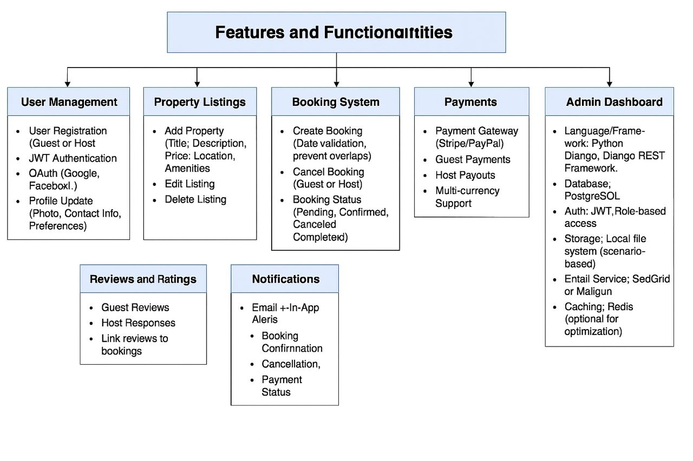

# alx-airbnb-project-documentation

## ✅ Features and Functionalities Overview

This section presents a visual outline of the main modules that make up the Airbnb Clone backend.  
Each component works together to provide a secure, efficient, and user-friendly experience for guests, hosts, and admins.

### **User Management**
- Supports guest and host registration  
- Handles authentication with JWT and social logins (Google, Facebook)  
- Allows users to update and manage profile details  

### **Property Listings**
- Enables hosts to create, modify, or remove property listings  
- Stores essential details such as title, price, location, and amenities  

### **Search and Filters**
- Lets users discover properties based on:  
  - Destination or location  
  - Budget range  
  - Guest capacity and available amenities  

### **Booking System**
- Allows guests to reserve available properties  
- Supports cancellations and real-time status updates  
- Includes date validation to prevent overlapping bookings  

### **Payment Processing**
- Handles secure transactions through Stripe or PayPal  
- Automates host payouts  
- Supports payments in multiple currencies  

### **Reviews and Ratings**
- Guests can leave detailed feedback for completed stays  
- Hosts can reply to reviews for transparency and engagement  

### **Notifications**
- Sends both in-app and email alerts for:  
  - New bookings  
  - Payment confirmations  
  - Booking cancellations  

### **Admin Dashboard**
- Provides oversight and control for admins to manage:  
  - Users and roles  
  - Listings and bookings  
  - Payments and system activities  

---

## 🛠️ Technology Stack

- **Backend Framework:** Django & Django REST Framework (Python)  
- **Database:** PostgreSQL  
- **Authentication:** JWT and OAuth integrations  
- **File Storage:** Local or cloud-based (for property images and user uploads)  
- **Email Service:** SendGrid or Mailgun for automated notifications  
- **Caching Layer:** Redis for faster responses and reduced load  

---

## 📎 Diagram File
The full **backend features diagram (PNG)** can be found here:  
