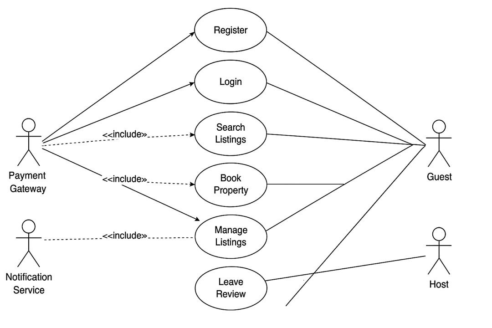

# Airbnb Clone — Use Case Diagram

## 🎯 Objective
This diagram visualizes how users and external systems interact with the backend functionalities of the Airbnb Clone application.

It highlights major actors — **Guests, Hosts, Admins,** and **Payment Gateway** — and their relationships with the system’s use cases, such as booking, payments, and property management.

---

## 👥 Key Actors
- **Guest:** Can search for listings, make bookings, submit payments, and leave reviews.  
- **Host:** Can manage property listings and respond to guest reviews.  
- **Admin:** Has full system access for managing users, listings, and transactions.  
- **Payment Gateway:** Handles secure financial transactions between guests and hosts.

---

## ⚙️ Major Use Cases
1. **User Management:** Account registration, authentication, and profile updates.  
2. **Property Listings:** Create, update, and remove property details.  
3. **Search & Filter:** Browse listings using filters like price, location, and amenities.  
4. **Booking System:** Reserve, cancel, and track bookings.  
5. **Payment Integration:** Process payments and host payouts securely.  
6. **Reviews and Ratings:** Guests provide feedback; hosts can respond.  
7. **Notifications:** Alerts for bookings, payments, and cancellations.  
8. **Admin Dashboard:** Oversight of users, listings, and all transactions.

---

## 📎 Diagram File
You can find the visual representation here:  
